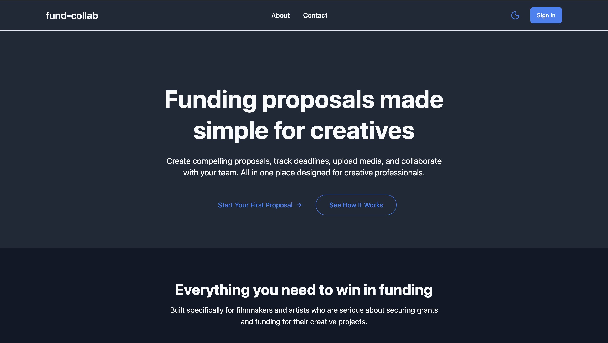
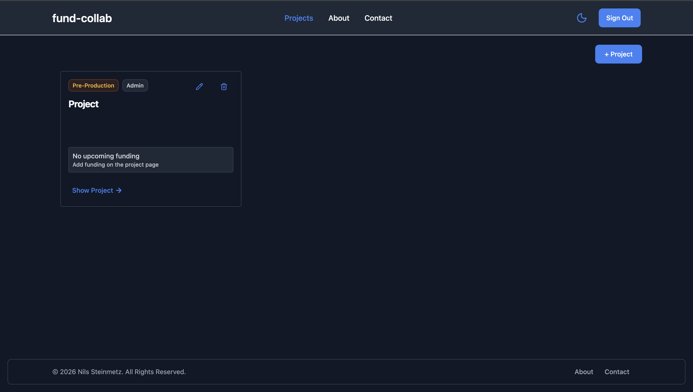
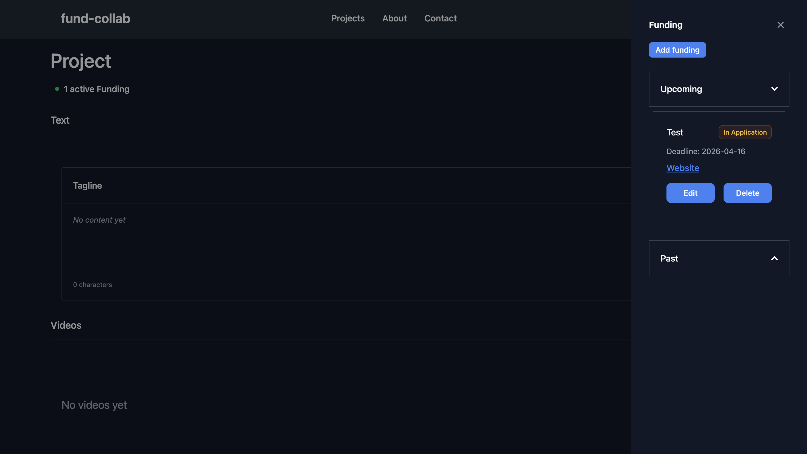

# FundCollab

Live Demo: [https://fund-collab.com/](https://fund-collab.com/)
GitHub: [https://github.com/nils-ste/fund-collab](https://github.com/nils-ste/fund-collab)

FundCollab is a full-stack collaborative funding platform designed for filmmakers and artists to create, manage, and contribute to shared funding projects in a structured and transparent way.

---

## Overview

FundCollab allows users to organize collaborative funding initiatives where multiple contributors can participate in reaching a shared financial goal.

The platform is designed to simulate real-world crowdfunding workflows, focusing on group participation, permission handling, and progress tracking.

This project demonstrates full-stack development skills including frontend UI development, backend API design, database integration, and authentication handling.

---

## Key Features

* User authentication (registration & login)
* Permission handling (admin, editor and viewer)
* Create collaborative funding projects
* Invite collaborators to your projects
* Track funding applications and their status
* User-specific dashboards for managing participation
* Funding sidebar with livetracker on the project page

---

## Tech Stack

Frontend

* React (vite)
* JavaScript (frontend application)
* HTML5, CSS3

Backend

* Python (Flask backend)

Database

* PostgreSQL

Other

* REST API architecture
* Authentication system (tokens)

---

## System Architecture

FundCollab follows a standard full-stack architecture:

* Frontend handles user interface and state
* Backend (Flask API) handles business logic and routing
* Database stores users, projects, funding, permissions and supabase routing
* Authentication system manages secure access to user-specific data

---

## Screenshots

> Add screenshots here (very important for portfolio impact)

| Home                            | Dashboard                                 | Project View                          |
| ------------------------------- | ----------------------------------------- | ------------------------------------- |
|  |  |  |

---

## Authentication Flow

* Users can register and log in securely
* Authenticated sessions allow access to dashboards and contribution features
* User-specific data is protected from unauthorized access

---

## Project Structure

```
backend/        # Flask backend API
frontend/       # Frontend application
static/         # Static assets
templates/      # HTML templates (if applicable)
```

---

## Getting Started

### 1. Clone the repository

```bash
git clone https://github.com/nils-ste/fund-collab.git
cd fund-collab
```

---

### 2. Backend setup

```bash
cd backend
pip install -r requirements.txt
python app.py
```

---

### 3. Frontend setup

```bash
cd frontend
npm install
npm start
```

---

## What This Project Demonstrates

This project highlights:

* Full-stack application development
* Frontend and backend integration
* REST API design with Flask
* Database-driven application design
* Authentication, Permissions and session handling
* CRUD operations for users and funding projects
* Real-world product thinking (collaborative workflows)

---

## Future Improvements

* Real-time updates for funding progress (WebSockets)
* Email notifications for project updates
* Section based Permissions instead of Project based Permissions
* Improved UI/UX responsiveness
* Accessibility features
* Automated testing (unit and integration)

---

## Author

Nils Steinmetz
GitHub: [https://github.com/nils-ste](https://github.com/nils-ste)

